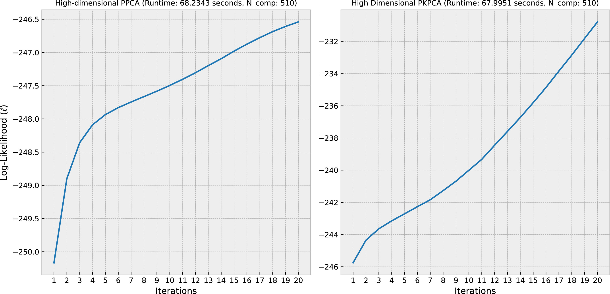
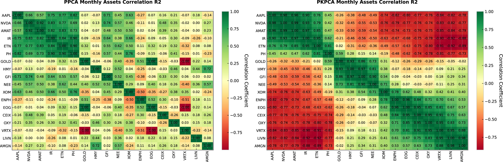

# Probabilistic Feature Extraction in JAX

[](https://www.python.org/downloads/)
[](LICENSE)
[](https://github.com/google/jax)
[](https://github.com/psf/black)

## Overview

**gen_fex** is a high-performance library for **Probabilistic Feature Extraction** and **Generative Modeling**, built on top of [JAX](https://github.com/google/jax). It is designed to handle high-dimensional, sparse time-series data, making it particularly effective for financial modeling in high-risk regimes.

This repository accompanies the manuscript **"Generative Modeling for High-Dimensional Sparse Data: Probabilistic Feature Extraction in High-Risk Financial Regimes"**. It implements robust probabilistic models that outperform conventional methods in capturing non-linear, time-dependent features, especially during volatile market conditions.

## ✨ Key Features

- **🚀 JAX-Accelerated**: Leverages JAX for high-performance numerical computing and automatic differentiation.
- **scikit-learn Compatible**: Fully compatible with the `scikit-learn` API (`fit`, `transform`, `inverse_transform`), allowing seamless integration into existing ML pipelines.
- **High-Dimensional Efficiency**: Automatically handles the "Transpose Trick" (Dual formulation) to efficiently process datasets where features ($D$) far exceed samples ($N$).
- **Missing Data Imputation**: Robust reconstruction of missing values in sparse datasets.
- **Advanced Models**:
  - **PPCA (Probabilistic PCA)**: A probabilistic framework for PCA that handles noise and missing data.
  - **PKPCA (Probabilistic Kernel PCA)**: Extends PPCA with kernel methods (e.g., RBF) and Wishart processes to capture non-linear structures.

## 🛠️ Installation

### Prerequisites

- Python **3.10** or newer.

### Install via pip

You can install the package directly from GitHub:

```bash
pip install git+https://github.com/AI-Ahmed/gen_fex.git
```

### Development Installation

If you want to contribute or modify the code:

1. **Clone the repository:**

   ```bash
   git clone https://github.com/AI-Ahmed/gen_fex.git
   cd gen_fex
   ```

2. **Install using Flit:**

   ```bash
   pip install flit
   flit install --deps develop --extras test --symlink
   ```

## 🚀 Quick Start

Here is a simple example of how to use the `PPCA` and `PKPCA` classes.

```python
import numpy as np
from gen_fex import PPCA, PKPCA

# 1. Generate synthetic high-dimensional data (Samples < Features)
# Shape: (N_samples, D_features)
N, D = 100, 1000
data = np.random.rand(N, D)

# 2. Initialize Models
# We choose a latent dimension q
q = 50
ppca = PPCA(q=q)
pkpca = PKPCA(q=q)

# 3. Fit Models
# The models automatically handle the high-dimensional nature (N < D)
print("Fitting PPCA...")
ppca.fit(data, use_em=True, verbose=1)

print("Fitting PKPCA...")
pkpca.fit(data, use_em=True, verbose=1)

# 4. Transform (Dimensionality Reduction)
latent_ppca = ppca.transform()
latent_pkpca = pkpca.transform()

print(f"Original Shape: {data.shape}")
print(f"PPCA Latent Shape: {latent_ppca.shape}")   # (q, D) - Latent features
print(f"PKPCA Latent Shape: {latent_pkpca.shape}") # (q, D) - Latent features

# Note: The model decomposes X approx W @ Z
# W: (N, q) - Sample embeddings
# Z: (q, D) - Latent features (returned by transform)

# 5. Reconstruction (Inverse Transform)
recon_ppca = ppca.inverse_transform(latent_ppca)
print(f"Reconstructed Shape: {recon_ppca.shape}")
```

## 🧮 Mathematical Background

### Probabilistic PCA (PPCA)

PPCA defines a generative model where the observed data $\mathbf{x}$ is generated from a latent variable $\mathbf{z}$ via a linear transformation with Gaussian noise:

$$ \mathbf{x} = \mathbf{W}\mathbf{z} + \boldsymbol{\mu} + \boldsymbol{\epsilon} $$

where $\mathbf{z} \sim \mathcal{N}(\mathbf{0}, \mathbf{I})$ and $\boldsymbol{\epsilon} \sim \mathcal{N}(\mathbf{0}, \sigma^2\mathbf{I})$.

### Dual Formulation & The Transpose Trick

For high-dimensional data where the number of features $D$ is much larger than the number of samples $N$ ($D \gg N$), standard PCA is computationally expensive ($O(D^3)$). **gen_fex** implements the **Dual PPCA** formulation (often called the "Transpose Trick"), which operates on the $N \times N$ Gram matrix instead of the $D \times D$ covariance matrix, significantly reducing computational cost to $O(N^3)$.

### Probabilistic Kernel PCA (PKPCA)

PKPCA extends this by mapping data into a non-linear feature space using a kernel function (e.g., RBF). Our implementation utilizes a **Wishart Process** prior for the covariance matrix, allowing for robust uncertainty quantification in the kernel space.

## 📊 Results & Performance

We evaluate our models on high-dimensional sparse financial data. Below are comparisons of model performance and reconstruction quality.

### Model Performance Comparison


*Comparison of PPCA and PKPCA performance metrics.*

### Reconstructed Data Comparison


*Visual comparison of original vs. reconstructed data for PPCA and PKPCA.*

## 📁 Directory Structure

```text
.
├── gen_fex/            # Source code
│   ├── _ppcax.py       # PPCA implementation
│   └── _pkpcax.py      # PKPCA implementation
├── tests/              # Unit tests
├── pyproject.toml      # Project configuration
└── README.md           # Documentation
```

## 🧪 Running Tests

To ensure everything is working correctly, run the test suite:

```bash
pytest tests/test.py
```

## 🤝 Contributing

Contributions are welcome! Please feel free to submit a Pull Request.

1. Fork the repository.
2. Create your feature branch (`git checkout -b feature/AmazingFeature`).
3. Commit your changes (`git commit -m 'Add some AmazingFeature'`).
4. Push to the branch (`git push origin feature/AmazingFeature`).
5. Open a Pull Request.

## 📄 License

This project is licensed under the [Apache License 2.0](LICENSE).

## 📣 Citation

If you use this software in your research, please cite our manuscript:

```bibtex
@article{ATWA2026113376,
title = {Generative modeling for high-dimensional sparse data: Probabilistic feature extraction in high-risk financial regimes},
journal = {Engineering Applications of Artificial Intelligence},
volume = {164},
pages = {113376},
year = {2026},
issn = {0952-1976},
doi = {https://doi.org/10.1016/j.engappai.2025.113376},
url = {https://www.sciencedirect.com/science/article/pii/S0952197625034074},
author = {Ahmed Nabil Atwa and Mohamed Kholief and Ahmed Sedky},
keywords = {Probabilistic principal component analysis, Probabilistic kernel principal component analysis, Wishart process, Missing value imputation, Information-driven bars, Hierarchical risk parity}
}
```
